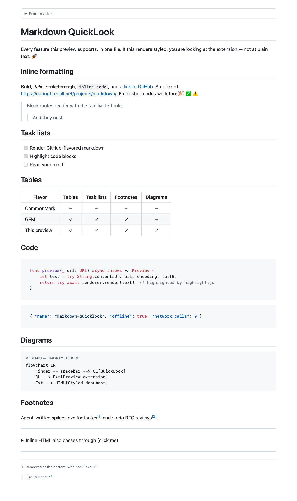
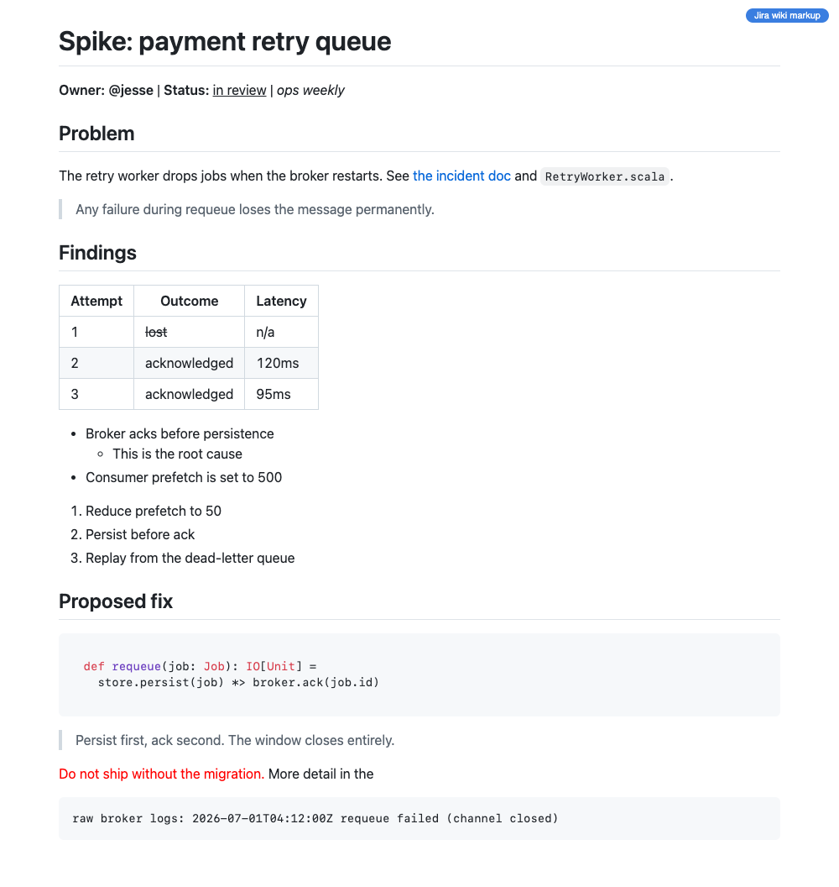
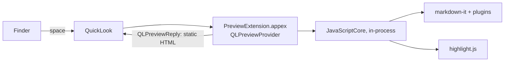

# macOS-md-quicklook

A Markdown viewer for Quick Look — press Space on a `.md` file in Finder
and read it rendered, not as plain text. A native QuickLook preview
extension built and tested on macOS Tahoe 26 (deployment target
macOS 14+). Fully offline, sandboxed, ad-hoc signed, no App Store, no
third-party binaries: `git clone && make install`. An open-source
alternative to Peek or QLMarkdown for machines where you can't install
either — corporate IT can read every line it ships.

| GitHub-flavored Markdown | Jira wiki markup |
| --- | --- |
|  |  |

## What renders

- **CommonMark + GFM**: tables, task lists, strikethrough, autolinks
  (via `markdown-it` with the GFM feature set)
- **Footnotes**, **emoji shortcodes** (`:rocket:`), YAML **front matter**
  (shown as a collapsible block)
- **Syntax highlighting** for the highlight.js common set plus Scala,
  Dockerfile, PowerShell, Protobuf, Elixir, Haskell, Dart, Groovy,
  Clojure, Erlang, Julia, and nginx
- **Mermaid fences** shown as labeled diagram source (data-based
  QuickLook previews execute no scripts, so diagrams cannot be laid out)
- **Jira / Confluence wiki markup** (`h1.`, `{code}`, `||tables||`,
  `{quote}`, `{color}`, `[link|url]`, nested `*`/`#` lists, …) —
  translated to Markdown before rendering, with a badge marking the
  conversion
- Automatic **light / dark mode**, GitHub look and feel

File extensions claimed: `md, markdown, mdown, mkdn, mkd, mdwn, mdtxt,
mdtext, mdx, rmd, qmd` (UTI `net.daringfireball.markdown`) and
`jira, confluence` (UTI `com.deepc0py.jira-wiki`).

## Install

Requires Xcode 16+ and [XcodeGen](https://github.com/yonaskolb/XcodeGen)
(`brew install xcodegen`).

```sh
git clone git@github.com:deepc0py/macOS-md-quicklook.git
cd macOS-md-quicklook
make install
```

`make install` builds Release, installs to `~/Applications`, registers
the extension, and opens the companion app. Then:

1. If previews still show plain text, open **System Settings → General →
   Login Items & Extensions → Quick Look** and enable
   **Markdown QuickLook Preview** (the app has a button for this).
2. Press Space on any Markdown file in Finder.

The companion app window doubles as a self-test: its right pane renders
the bundled sample **through the same QuickLook machinery Finder uses**.
If that pane is styled, spacebar previews are working. Drop any file
onto it to test.

The build is ad-hoc signed (`CODE_SIGN_IDENTITY=-`): no developer
account, no notarization, nothing leaves the machine. Everything the
renderer needs is vendored into the extension bundle; the extension is
sandboxed with no network entitlement, so previews can never phone home.

## How it works



The extension is a **data-based preview** (`QLPreviewProvider` →
`QLPreviewReply` of HTML): it hands QuickLook a finished, self-contained
HTML page and the system displays it in its own process. This is not a
style choice — on macOS 26 the QuickLook extension sandbox refuses to
launch WKWebView's WebContent helper process (`web process failed to
launch`, an eternal spinner), so rendering inside the extension must not
spawn any web processes at all.

- `Extension/PreviewProvider.swift` decodes the file (UTF-8 first,
  BOM/xattr detection, then CP1252/Latin-1) and returns the rendered
  page. Failures throw, so QuickLook reports them instead of hanging.
- `Extension/Renderer.swift` runs the vendored JS pipeline inside
  JavaScriptCore — no DOM, no helper processes — and inlines all CSS
  into the page.
- `Extension/Resources/render.js` configures markdown-it (GFM,
  footnotes, task lists, emoji), routes fenced code through highlight.js,
  and strips `<script>` tags from inline HTML (defense in depth; the
  preview host never executes JavaScript anyway).
- `Extension/Resources/jira.js` converts Jira wiki markup. Files named
  `*.jira`/`*.confluence` always convert; other files convert only when
  they score at least two strong Jira signals (`h1.` headings, `{code}`,
  `{noformat}`, `||header||`, `bq.`, `{quote}`, `{panel}`) **and**
  contain no Markdown headings or fences. `make test-jira` runs a
  regression check over the sample.
- `make test-render` compiles the exact Renderer + JS stack into a CLI
  and checks the HTML produced for both samples; `make test-jira` covers
  the converter alone.

## Limitations

- Previews are static: no JavaScript runs in the QuickLook panel, which
  is why mermaid fences appear as source. Everything else is rendered
  ahead of time inside the extension.
- Images referenced by relative path don't load: QuickLook's sandbox
  grants the extension access to the previewed file only. Remote images
  (including tracking pixels) are blocked by a Content-Security-Policy
  baked into every page — only `data:` URI images render. Deliberate.
- `qlmanage -p` does not host third-party preview extensions on modern
  macOS; test with Finder or the companion app instead.
- Jira markup without a header row renders its tables as plain rows —
  Markdown tables require a header.

## Vendored dependencies

Pinned and committed under `Extension/Resources/vendor/` (checksums in
`SHA256SUMS`, re-fetch with `scripts/fetch-vendor.sh`):

| Package | Version | License |
| --- | --- | --- |
| [markdown-it](https://github.com/markdown-it/markdown-it) | 14.1.0 | MIT |
| [markdown-it-footnote](https://github.com/markdown-it/markdown-it-footnote) | 4.0.0 | MIT |
| [markdown-it-task-lists](https://github.com/revin/markdown-it-task-lists) | 2.1.1 | ISC |
| [markdown-it-emoji](https://github.com/markdown-it/markdown-it-emoji) | 3.0.0 | MIT |
| [highlight.js](https://github.com/highlightjs/highlight.js) | 11.11.1 | BSD-3-Clause |
| [github-markdown-css](https://github.com/sindresorhus/github-markdown-css) | 5.8.1 | MIT |

The Jira conversion rules are informed by
[J2M](https://github.com/FokkeZB/J2M) (MIT).

## Uninstall

```sh
make uninstall
```

## License

MIT — see [LICENSE](LICENSE).
