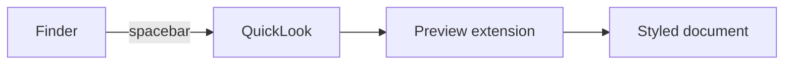

# Markdown QuickLook

Every feature this preview supports, in one file. If this renders styled,
you are looking at the extension — not at plain text. :rocket:

## Inline formatting

**Bold**, *italic*, ~~strikethrough~~, `inline code`, and a [link to
GitHub](https://github.com). Autolinked: https://daringfireball.net/projects/markdown/.
Emoji shortcodes work too: :tada: :white_check_mark: :warning:

> Blockquotes render with the familiar left rule.
>
> > And they nest.

## Task lists

- [x] Render GitHub-flavored markdown
- [x] Highlight code blocks
- [ ] Read your mind

## Tables

| Flavor | Tables | Task lists | Footnotes | Diagrams |
| ------ | :----: | :--------: | :-------: | :------: |
| CommonMark | – | – | – | – |
| GFM | ✓ | ✓ | ✓ | – |
| This preview | ✓ | ✓ | ✓ | ✓ |

## Code

```swift
func preview(_ url: URL) async throws -> Preview {
    let text = try String(contentsOf: url, encoding: .utf8)
    return try await renderer.render(text)  // highlighted by highlight.js
}
```

```json
{ "name": "markdown-quicklook", "offline": true, "network_calls": 0 }
```

## Diagrams

Mermaid fences are kept as labeled source — QuickLook previews run no
scripts, so the diagram below is readable but not drawn:



## Footnotes

Agent-written spikes love footnotes[^1] and so do RFC reviews[^2].

[^1]: Rendered at the bottom, with backlinks.
[^2]: Like this one.

---

<details>
<summary>Inline HTML also passes through (click me)</summary>

Press <kbd>Space</kbd> in Finder. That is the whole workflow.

</details>
